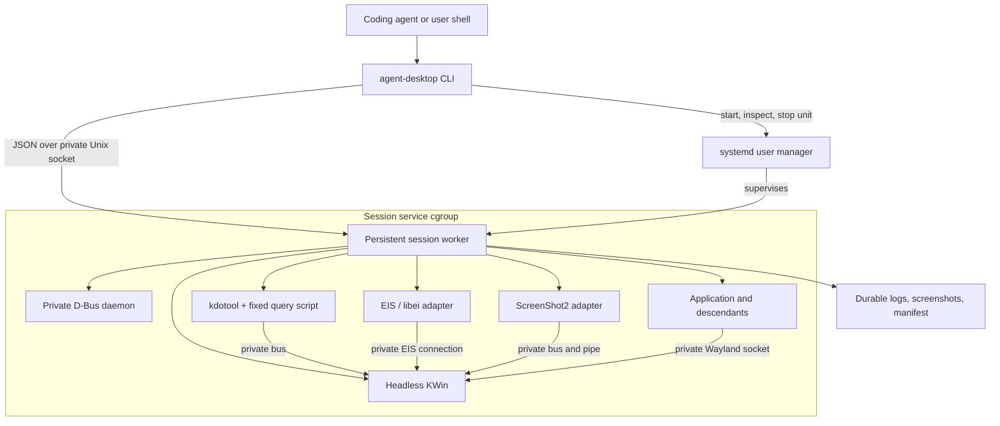

# Agent Desktop Toolkit — Proposed Architecture

## Purpose and status

This architecture proposes how to satisfy [REQUIREMENTS.md](REQUIREMENTS.md): a
small local toolkit that runs a trusted graphical application in a separate
KWin desktop and exposes launch, window control, input, screenshots, and cleanup
through a CLI.

Status: proposed design. No implementation or compatibility guarantee is implied.
Implementation sequencing belongs in a later plan. The requirements are the
product contract; dependency choices here can change when evidence justifies it.

## 1. Main decisions

| Area | Proposal | Requirements |
| --- | --- | --- |
| Desktop | A dedicated headless KWin instance; one 1280×720 output at scale 1; no Plasma shell | REQ-001, REQ-002 |
| Public interface | A Python CLI named `agent-desktop`, with JSON available on every command | REQ-003, REQ-004 |
| Session owner | One persistent Python worker in a transient systemd user service | REQ-008–REQ-012 |
| Desktop connections | Private D-Bus and Wayland endpoints, explicitly passed to every adapter and application | REQ-006, REQ-007 |
| Window control | Pinned `kdotool`, including a fixed KWin JavaScript query for structured metadata | REQ-017–REQ-024, REQ-041, REQ-042 |
| Input | Project-owned adapter using KWin's private EIS connection and libei directly | REQ-025–REQ-031, REQ-036 |
| Capture | Project-owned adapter using KWin's ScreenShot2 D-Bus interface and Pillow for PNG encoding | REQ-032, REQ-033 |
| Process lifetime | Worker tracks applications; systemd owns cleanup of the complete session process tree | REQ-012, REQ-015, REQ-016, REQ-021, REQ-022 |
| Configuration and output | CLI flags, private runtime state, durable artifacts outside temporary settings | REQ-034, REQ-045, REQ-046 |
| Future viewing | Record a session mode now; defer optional live viewing without adding a second backend | REQ-043, REQ-047 |

The main composition is existing KWin, systemd, D-Bus, kdotool, and libei, with
Python code owning the behavior that spans them. A KWin JavaScript script can
query and manipulate windows; it does not supply the input, screenshot, or
process-lifetime responsibilities of this toolkit.

## 2. Components and ownership



**CLI/client:** parse arguments, resolve caller-relative paths, contact the user
service manager for lifecycle operations, and exchange structured requests with
the worker. It does not retain an input connection or desktop state between
invocations. It can stop the service even when the worker socket is unusable.

**Worker:** own session state, private desktop endpoints, application records,
window validation, action deadlines, cancellation, held input, and artifacts.
Adapters return typed results or errors; human-readable engine output is not a
state protocol.

**Supervisor:** start the private bus and compositor as observed child processes
inside the service. Use bounded readiness checks and monitor their exits.
Keep startup, application ownership, and cleanup policy in the project.

**Adapters:** keep window, input, and capture details local to small modules in
one Python package. They are internal boundaries, not a plugin system. A later
implementation may combine modules when that is simpler.

## 3. Session lifecycle and separation

Requirements: REQ-005–REQ-013, REQ-034.

### Identity and state

Maintain a human-readable session name and a new random generation ID for each
start. State progresses through `starting`, `ready`, `stopping`, and `stopped`;
an essential failure produces `failed` with cleanup pending or completed. The
durable manifest records the terminal outcome even after runtime state is gone.

Serialize start/stop decisions for a name. A compatible duplicate start returns
the existing generation; a conflicting configuration fails. Do not automatically
restart a failed service or reuse its target references.

`session start` and `session status` return the generation. All session-addressed
commands accept `--generation`; automation should retain and supply it. Name-only
commands deliberately address the current session. Every worker request carries
the resolved generation, and each application/window handle includes it. Check
identity before executing or stopping a unit, including the unresponsive-worker
path. Bind service and runtime ownership to the generation so cleanup cannot
remove a replacement session's files or stop its service.

### Startup and shutdown

The CLI requests a transient user service. Its worker starts a private D-Bus
daemon, then KWin, then the window/input/capture adapters. Publish `ready` only
after each capability probe succeeds. A bus address or socket appearing alone
does not establish readiness. Pipe reads and subprocess waits have deadlines.

All ordinary descendants remain in the service cgroup. Configure no automatic
restart, `KillMode=control-group`, and a finite `TimeoutStopSec`. On requested
shutdown, the worker cancels actions, attempts input release and normal window
closure, then exits; systemd terminates remaining processes. Service-manager
cleanup is the independent fallback for a blocked or dead worker. A compositor
or private-bus exit marks the session failed, rejects work, and initiates the
same bounded cleanup. Status checks the service and worker's monitored health.
A bounded service cleanup hook records the terminal outcome and removes owned
runtime state even if the worker died before updating its manifest. It checks
generation ownership before cleanup and preserves previously recorded failures.

### Environment boundary

Create owner-only runtime storage and a disposable HOME/XDG settings tree.
Construct a documented application environment with the private bus, Wayland
socket, and runtime paths. Strip host `DISPLAY`, `XAUTHORITY`, Wayland/D-Bus, and
accessibility endpoints before applying the private values. Do not offer a host
clipboard or input/capture fallback. Reject overrides of protected endpoint and
settings variables.

The CLI uses the host user service manager only to manage toolkit services.
Desktop adapters always receive explicit private endpoints. Any KWin permission
settings required for direct EIS or ScreenShot2 access apply only to the created
compositor process, never to the personal desktop or global configuration.

Applications keep normal user access to project files and the network. This is
desktop and settings separation for trusted programs, not a security sandbox.
Programs that deliberately escape process supervision or contact host endpoints
are outside this contract.

## 4. Command protocol and cancellation

Requirements: REQ-003–REQ-005, REQ-013, REQ-024, REQ-028, REQ-033, REQ-035.

Proposed command families:

```text
doctor
session start | status | stop
launch | windows | focus | wait
key | type | click | input reset
screenshot | logs
close | kill
```

Use a local Unix socket with a versioned JSON protocol. Requests include a
request ID, session generation, operation, arguments, and finite timeout. The
worker turns the timeout into a monotonic deadline at admission, including time
waiting behind another action. Responses include request ID, generation where
applicable, and either a result or an error with stable code, message, and context.
Desktop/session logs never enter the CLI's JSON stream.

Run one ordinary action at a time. Keep control handling, essential-process
monitoring, input lifecycle events, and deadline checks responsive while an action
is active. Use a GLib main loop for D-Bus/libei readiness and timers; express
input sequences and waits as short cancellable steps. Blocking capture work
runs outside that control loop with a deadline and owned cleanup. M1 selects one directly executed subprocess per capture, observed asynchronously
by the GLib owner. The child owns its private D-Bus connection, raw pipe and
Pillow work; the owner enforces its deadline and kill/reap reserve. An aborted
capture whose compositor resources cannot be confirmed reclaimed makes the
private session unavailable and triggers bounded session stop. See the measured
[M1 decision record](docs/M1_DECISION.md); this is a feasibility decision, not a
production implementation or support claim.
Observe kdotool subprocesses asynchronously so a slow focus query cannot block
the control loop or deadline handling.

CLI SIGINT sends cancellation for its request; connection loss also cancels an
unfinished ordinary action. Required startup-failure and shutdown cleanup
continues without the client. Cancellation, reset, and stop bypass the ordinary action
queue. They signal the active action's owner, which stops emission and performs
release, rather than concurrently manipulating libei from another thread.
Reset first cancels active input, then restores the connection to usable state.

Cancellation cannot undo a completed click, application launch, or GUI change.
An application launched before cancellation remains tracked; a timed-out window
wait does not discard its handle. Record partial or uncertain outcomes in the
manifest/logs and include handles in an error response when the client remains
connected. Do not retry a potentially completed action automatically. Request
IDs support correlation and cancellation, not a claim of exactly-once execution.

## 5. Application and window control

Requirements: REQ-014–REQ-024, REQ-027, REQ-042.

Launch with an argv array, not an implicit shell command. The CLI resolves
relative working-directory and artifact/output paths from its own cwd; omitted
application cwd means that caller cwd. Executable paths containing a slash
resolve relative to the application cwd; bare executable names use the final
application PATH. Construct environment defaults, apply explicit allowed
`--env KEY=VALUE` overrides, then install protected session values. Reject
protected overrides rather than silently ignoring them.

Assign an application ID and retain process-lifetime handles, exit status, logs,
and owned-descendant information. Use kernel process handles where available
instead of treating a saved PID as authority. Systemd guarantees session-wide
cleanup of ordinary descendants; application termination targets only verified
members of that application's tracked process set. Report remaining processes
if explicit termination cannot finish within its deadline.

Use kdotool against the private bus for window operations. Keep a fixed query
script that returns a JSON snapshot of KWin UUIDs, reported PIDs, captions,
application classes, client/frame geometry, and active-window identity. Pass
dynamic values as data with appropriate encoding, never as arbitrary caller
JavaScript. Associate windows with owned process identities; expose ambiguous
or unassociated candidates without guessing from a title.

Activation is a request followed by a bounded focus query. A successful kdotool
exit alone does not establish that a window existed or became focused. Recheck
existence and geometry when an action executes, including after queue delay.
Clicks translate client coordinates to the single output's coordinates.

Graceful close requests closure of the selected application window and waits for
the application. It leaves confirmation dialogs for explicit subsequent interaction.
`kill` is separate and reports the outcome of explicit process termination.

## 6. Input ownership

Requirements: REQ-023–REQ-031, REQ-033, REQ-036.

Establish an EIS connection through the created KWin's D-Bus interface and keep
the resulting libei connection in the worker. Use one execution context to
consume device events and emit input. Devices must be resumed before use;
dispatching alone is insufficient without consuming the resulting events.

Prevalidate a complete text/chord/click request, confirm the target and focus,
then execute short steps with tracked press/release state. Use timers for holds
and bounded focus polling. Publish the polling interval, query timeout, and
cancellation/release bound after measuring them with the intended service setup.
On a timed-out focus check, stop input rather than continuing with stale focus.
Polling does not provide atomic focus-bound input or prevent all compositor races.

Track every emitted key/button press, including modifiers generated during text
entry. Release on completion and failure. Pause, removal, or disconnect makes
the affected device unusable and cancels active input. If release cannot be
confirmed, report uncertainty and require successful reset or session shutdown
before accepting more input. Reset may recreate the private EIS connection but
does not replay an interrupted action.

### Project-owned libei adapter

Implement a small Python adapter with explicit ctypes declarations for the
required libei calls. Check those declarations against the supported libei
headers, including argument types, return types, and object ownership. For
example, `ei_dispatch` returns `void`; connection state comes from consumed
events, not a return code. See the
[libei API](https://libinput.pages.freedesktop.org/libei/api/group__libei.html).

The project owns connection negotiation, device readiness and lifecycle,
physical-key and supported-text mappings, input sequencing, and release/reset
behavior. Keep the binding surface limited to those responsibilities. Validate
the adapter against real compositor events and the cancellation contract before
claiming support. If the binding becomes difficult to maintain correctly,
reconsider a small compiled binding or native worker as described below.

## 7. Capture, artifacts, and diagnostics

Requirements: REQ-032–REQ-035, REQ-045.

Implement a direct ScreenShot2 D-Bus client against the private bus. The adapter
owns the capture pipe, concurrent draining while the request is pending,
response/image metadata validation, deadlines, and file-descriptor cleanup.
Decode the supported pixel format and encode the result as PNG with Pillow;
report unsupported formats explicitly.

The worker allocates a unique artifact path, captures the whole single output,
and publishes success only after the complete image is written. Write through a
temporary artifact and publish the completed file; keep failed captures
distinguishable from valid PNGs.

Return generation, path, dimensions, timestamp, and backend. Capture is a fresh
request; it does not promise that an application has reacted to preceding input.
Tests wait for fixture acknowledgment before asserting changed pixels. User
workflows can use application-specific signals or an explicit bounded delay.

Runtime sockets, lock/state files, and disposable settings live in owner-only
runtime storage. The user selects a durable artifact root, resolved by the CLI,
with a generation-specific directory for application logs, worker/compositor
diagnostics, screenshots, and a manifest. Preserve these on failure and shutdown.
Record tested dependency versions and patches, mode/geometry, application argv
and cwd, request outcomes, and final session state. Do not dump the inherited
environment or credentials into diagnostics.

## 8. Dependency and build policy

Requirements: REQ-036, REQ-041, REQ-042.

| Dependency | Initial policy and ownership |
| --- | --- |
| KWin, systemd, D-Bus, libei | Use target-machine packages and record tested versions. Direct KWin interfaces make compatibility testing necessary. |
| Python, PyGObject, dbus-python, Pillow | Use a project environment with documented access to the required distribution native bindings; record the complete resolved environment. |
| kdotool | Pin a tested revision supporting custom scripts. Reviewed candidate: `be03ce90c09350898556436bac74ed35fe928617`. A Cargo source build is an installation dependency when a suitable package is unavailable; the compiled executable is used at runtime. |

`ydotool` and `kwin-mcp` are excluded from build and runtime dependencies. Do not
install, invoke, patch, or vendor either package as part of this toolkit. Input
and capture are project-owned modules using the underlying platform APIs. The
initial toolkit has no MCP SDK dependency; a future MCP integration is optional
under REQ-050.

### Alternatives and reasons to reconsider

- **Custom KWin JavaScript bridge:** defer. kdotool already supports custom
  scripts, JSON output, D-Bus result ordering, timeouts, and script cleanup.
  Replace it only if measured query/polling behavior or transport limitations
  force substantial additional machinery. Custom JSON alone is not a reason.
  [Reviewed kdotool implementation](https://github.com/jinliu/kdotool/blob/be03ce90c09350898556436bac74ed35fe928617/src/main.rs)
- **Spectacle:** an alternative to investigate only if direct capture fails or
  proves costly to maintain. Verify private-session behavior before adopting it;
  do not maintain two screenshot paths without a demonstrated need.
- **Compiled binding or external C++/Qt worker:** reconsider if maintaining the
  Python/libei declarations becomes costly or unreliable. Compiling against
  libei headers checks function signatures, while device lifecycle and
  cancellation logic remain project responsibilities.
  A native worker would run as an external process using D-Bus/libei.

## 9. Validation and unresolved design parameters

Requirements: REQ-036–REQ-040, REQ-044.

These are architecture acceptance questions, not implementation milestones:

1. **Window transport:** demonstrate UUID/PID discovery, client bounds, verified
   focus, vanished-target errors, and bounded polling through kdotool in the
   actual private service environment. Retain it if that composition is adequate.
2. **Input correctness:** verify the project-owned bindings against libei headers
   and demonstrate strict readiness, ongoing event consumption, cancellation,
   device loss, and release behavior. Assess whether the small Python binding
   remains maintainable or merits a compiled boundary.
3. **Control-loop responsiveness:** choose and document finite startup/action/stop
   deadlines and input polling/cancellation bounds from measured behavior. Test
   CLI SIGINT, client disconnect, reset, and timeout during holds and modified
   typing, including while other desktop calls are slow.
4. **Supervision and identity:** independently terminate the worker, compositor,
   and bus; verify cleanup and retained diagnostics. Test duplicate start,
   stale generations after restart, child processes, and caller path/environment
   semantics.
5. **Observation and usefulness:** run real capture and acknowledged input through
   separate CLI processes. Complete the twenty-run requirement and record a
   representative application before claiming its support. Custom-rendered
   discovery must not depend on accessibility metadata.

Prior local review using a separate third-party prototype demonstrated one
virtual KWin session, an 800×600 ScreenShot2 capture, exact text receipt in a GTK
fixture, and cleanup. That is evidence of platform feasibility; it does not
validate the proposed project-owned adapters, repeated reliability, this service
architecture, cancellation, game compatibility, or live viewing. Those claims
remain subject to the requirements above.

## 10. Future extensions

Requirements: REQ-043, REQ-047–REQ-050.

Keep `headless` as an explicit mode in session configuration and artifacts.
Optional live viewing may use a visible nested KWin backend or a viewer; whether
it can attach to an existing headless session is unresolved. Preserve screenshots
and the same application-control contract. If a visible compositor needs a host
display connection, provide it only to that compositor process; applications
continue to use the private inner desktop.

Private XWayland, richer input, other output layouts, multiple applications, and
MCP integration require their own capability and validation work. They do not
justify additional runtime backends or a plugin framework in the first version.


### M3.3 implementation decision

The user approved a packaged M1 provisional readiness provider and immutable
`session start --dependency-root` configuration; no plugin framework or runtime
checkout import is introduced. The existing GLib owner uses cancellable Gio
asynchronous private bus/EIS setup, the audited libei owner and a killable capture
child. Runtime readiness is explicit about provisional support and replacement
by M7.1/#35. The user also approved systemd watchdog termination after 5s without
GLib heartbeats, with explicit 3s abort escalation, healthy-start heartbeats every 1s,
and independent bus/KWin observations sharing a 1s round. These policies implement
REQ-009/011 without background heartbeats or automatic restart. See the detailed
[lifecycle bounds](docs/LIFECYCLE.md#capability-readiness-and-live-health-20).


### M3.4 implementation decision

Generation-specific `ExecStop` and `ExecStopPost` commands now provide independent
shutdown and finalization. The owner orders cancellation, bounded tracked-release
and normal-close hooks before service escalation; production release/close adapters
remain explicitly unconnected until #35. Stop-post authenticates its own cgroup,
uses pidfds to terminate remaining verified ordinary descendants, then removes
only owned disposable settings/sockets. This active survivor step is necessary:
on systemd 261.3 the post command can run before a resistant grandchild is killed.
A passive post hook would leave runtime cleanup incomplete without a later client.

Generation locks serialize all lifecycle record mutations without taking the
per-name lock inside service hooks. Immutable explicit-stop intent is distinct
from the internal stop relay and watchdog SIGTERM, preserving prior failures and
requested-fallback outcome semantics. Durable post receipts distinguish ordinary
process absence from an outside observation of total cgroup emptiness. See
[the shutdown contract](docs/LIFECYCLE.md#autonomous-shutdown-and-finalization-21)
and [installed qualification](evidence/issue-21/README.md).

M4.1 application ownership uses one delegated cgroup per application beneath the
existing session service. A gated isolated helper enters containment and the
worker retains/persists its identity before authorizing exec. Root PID exit does
not release the one-application slot while ordinary descendants remain. See
[application ownership and bounds](docs/APPLICATIONS.md).
